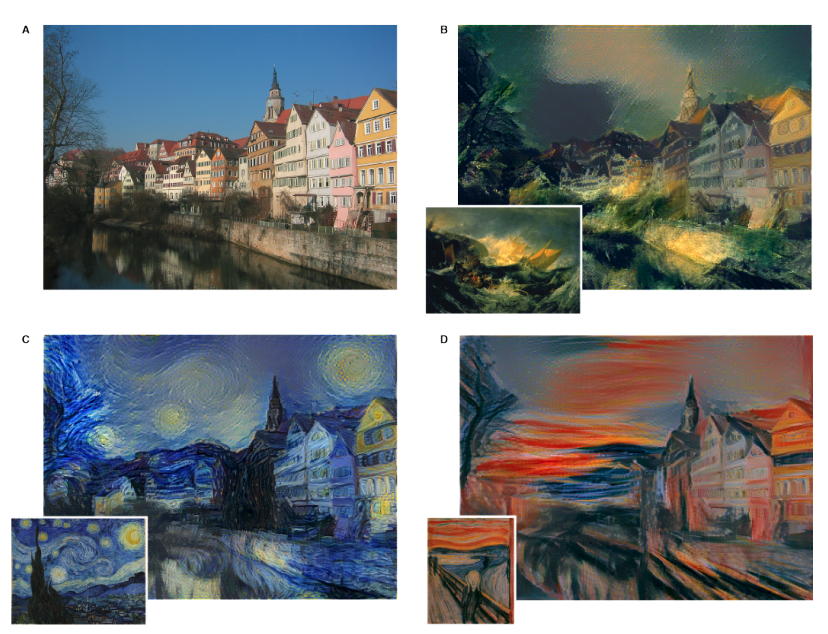
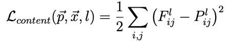
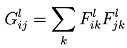
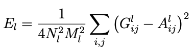
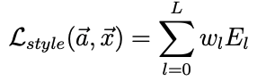
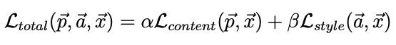

# Neural Style Transfer - Pytorch implementation 

This repository contains the code that replicates the paper of [Gatys et al.](https://arxiv.org/pdf/1508.06576.pdf),
that introduced Neural Style Transfer in 2015.

Neural Style Transfer is an optimization technique to manipulate an image and apply the visual appearance of another one.
This allows to create peculiar artworks like the following, which I borrowed from the original paper.

As you see from the example, the author applied the style of different paintings to 
a picture of buildings, resulting in artworks that mimic the resemblance of the paintings.

# How it works

In order to explain the functioning of the technique, we need to differentiate between the Content
Image and the Style Image. Those two will be merged as to apply the style of the Style Image to the Content Image.
Alongside with them, we have a Generated Image which is initially just random noise.

The three images are fed into a pre-trained Convolutional Neural Network. In the original paper, the authors
use VGG-19.
However, you do not directly train this network.
What you do instead is taking (some of) the feature maps generated by the three images and compute
the following losses:

**Content Loss**: 

where $F^l_{i,j}$ and $P^l_{i,j}$ represent the activation map of the $i^{th}$ filter at position $j$ of layer $l$, 
respectively corresponding to the Content Image and the Generated Image.

The intuition behind the minimization is that we want the activation maps of the Content Image and Generated Image to be as close as possible.
This is because the convolutional layers tend to recognize shapes in the input image, hence we would like the net to spot
the same figures in the Content and Generated images.

**Style Loss** 

The computation of the Style Loss is a bit trickier.
In this case, we still take the activation maps of the Style and Generated Image,
and we use them to compute the Gram matrix $G^l$, each element given by:

The Gram matrix of a layer $l$ calculates the correlation between each activation map.

From this, we compute:

where $G^l_{i,j}$ and $A^l_{i,j}$ is the inner product between the vectorised feature map
$i$ and $j$ in layer $l$.
And subsequently:

where $w_l$ is a weighting factor which we usually set to 1.

The total loss is finally given by:

where $\alpha, \beta$ weights the contribution of the Content Loss and the Style Loss.

As we mentioned earlier, the optimization is not performed on the weights on the network, yet it's performed on
the Generated Image which is fed into the network at each training step.
By performing gradient descent on the Generated Image, we force it to represent the composition of the Content Image, yet
in the texture of the Style Image.

A possible modification which has been tried is to use the Content Image itself as a starting point for the Generated one, instead
of random noise. In this implementation I adopted this.

# How to run

First, install the Poetry env:

`poetry install`

After that, you can place your content images in the `content` folder and the style images in the `style` folder.

Then, open `nst.py` to configure the optimization. When you are ready to go, just launch:

`python nst.py`

The output will be placed in the `generated` folder.